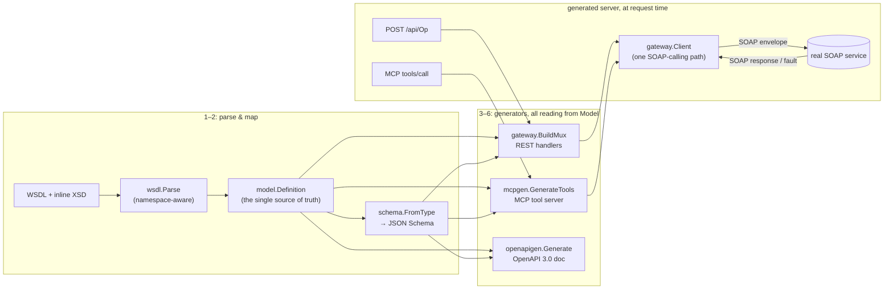

# soapbridge

Turn a WSDL into a REST API, an MCP tool server, and an OpenAPI spec — automatically.

## The problem

Enterprise systems — TMS, WMS, ERP, insurance and logistics platforms — commonly
expose only SOAP/XML APIs, often against WSDL contracts written a decade ago.
Every team integrating with one hand-rolls the same SOAP-to-JSON translation
layer: parse the WSDL, build the envelope, POST it, parse the response,
handle faults, wire it to whatever's calling it. Increasingly "whatever's
calling it" is an AI agent, which wants MCP tools, not raw XML.

`soapbridge` automates that layer. Point it at a WSDL and it generates a
standalone, runnable Go server exposing every SOAP operation as:

- a **REST** endpoint (`POST /api/{OperationName}`, JSON in, JSON out)
- an **MCP** tool (stdio for local agents, HTTP for remote ones)
- an **OpenAPI 3.0** document describing the REST surface

All three read from one internal model built by parsing the WSDL once — they
can't drift apart, because there's nothing to drift.

## Quickstart

```sh
brew install harshhh28/soapbridge/soapbridge
# or: go install github.com/harshhh28/soapbridge/cmd/soapbridge@latest
# or, from a checkout: go build -o soapbridge ./cmd/soapbridge

soapbridge generate \
  --wsdl testdata/wsdl/calculator.wsdl \
  --out /tmp/calculator-gateway \
  --mcp --openapi --run
```

> Running the demo from *inside* a soapbridge checkout? Point `--out`
> somewhere outside the repo (as above), not at `./gateway` — this repo's
> own source lives in a package directory literally named `gateway/`, and
> `--out ./gateway` is a collision, not a coincidence. `generate` refuses
> to scaffold into a directory that already holds unrelated Go source, so
> this fails loudly rather than corrupting it — but picking a clean
> directory avoids the error entirely. In any other project, the plain
> `--out ./gateway` from the CLI help text is fine.

`--run` builds and immediately runs the generated server for a fast demo
loop; drop it to just scaffold, then run it yourself:

```sh
cd /tmp/calculator-gateway && go run .
# or: soapbridge serve --config /tmp/calculator-gateway/config.yaml
```

Then:

```sh
curl -X POST localhost:8080/api/Add -d '{"intA": 4, "intB": 5}'
# {"AddResult":9}

curl localhost:8080/openapi.json

curl -X POST localhost:8080/mcp -d '{"jsonrpc":"2.0","id":1,"method":"tools/list"}'
```

> **A note on the generated module's `go.mod`.** The generated server
> depends on this repo like any other Go dependency: `require
> github.com/harshhh28/soapbridge <version>`, resolved from the module
> proxy — a released `soapbridge` binary (Homebrew or `go install`) embeds
> its own version and pins to that automatically. Running `generate` from
> *within* a soapbridge checkout instead uses a local `replace` to that
> checkout (auto-detected, or pass `--soapbridge-dir`) — the dev workflow,
> so you're always testing against your local changes rather than the last
> release.

### No real backend to test against? `soapbridge mock`

Plenty of WSDLs — especially internal/enterprise exports — declare a
placeholder `soap:address` rather than a real reachable endpoint. Rather
than write a stub SOAP service by hand, run one straight from the same
WSDL:

```sh
soapbridge mock --wsdl testdata/wsdl/calculator.wsdl --addr :9000 &

soapbridge generate --wsdl testdata/wsdl/calculator.wsdl --out /tmp/calc-gw \
  --endpoint http://localhost:9000/soap --mcp --openapi --run &

curl -X POST localhost:8080/api/Add -d '{"intA": 4, "intB": 5}'
# {"AddResult":1}   <- synthetic, but a real round trip: REST -> generated
#                       gateway -> real SOAP call -> mock -> SOAP response -> JSON
```

`mock` answers every operation with schema-shaped example data (required
fields populated with placeholder values, optional fields omitted, arrays
get one example item) — it dispatches by the request's body element, not
SOAPAction, so it works even for WSDLs where every operation declares an
empty SOAPAction. `--endpoint` on `generate` rewrites the WSDL's declared
`soap:address` before embedding it, so the generated server talks to
whatever you point it at instead of what the WSDL says.

## Architecture



The REST handler and the MCP tool handler both call the same
`gateway.Client.Call` — there is exactly one place that builds SOAP
envelopes and parses SOAP responses, so REST and MCP can never disagree
about what an operation does.

### Packages

| Package | Responsibility |
|---|---|
| `wsdl` | Parses WSDL 1.1 + inline XSD into `model.Definition`. Namespace-aware: resolves prefixes via the xmlns scope in effect at each element, so it doesn't matter whether a document uses `xs:`/`wsdl:`, `s:`/(default), or anything else. |
| `model` | The internal representation every generator reads — operations, types, bindings. Not tied to XML at all. |
| `schema` | Pure `model.Type → JSON Schema` mapper, plus a small dependency-free JSON Schema validator for the subset it emits. |
| `gateway` | Builds SOAP envelopes from JSON, POSTs them, parses responses/faults back to JSON, maps faults to HTTP status codes, injects WS-Security UsernameToken. Exposes both the REST `http.Handler`s and the `Client` MCP calls through. |
| `mcpgen` | Turns operations into MCP tool definitions and serves them over stdio or HTTP (JSON-RPC 2.0: `initialize`, `tools/list`, `tools/call`). |
| `openapigen` | Turns operations into an OpenAPI 3.0 document. |
| `mockserver` | Answers every operation in a WSDL with synthetic, schema-shaped example data — a stand-in SOAP service for exercising a generated gateway without a reachable real backend. |
| `internal/genserver` | CLI-only: scaffolds the generated Go module (`go.mod`, `main.go`, embedded WSDL, `config.yaml`). Not imported by generated code. |
| `cmd/soapbridge` | The `generate`, `serve`, and `mock` CLI commands. |

## CLI

```
soapbridge generate --wsdl <path-or-url> --out <dir> [--mcp] [--openapi] [--endpoint <url>] [--run]
soapbridge serve --config <dir>/config.yaml
soapbridge mock --wsdl <path-or-url> [--addr <addr>] [--path <path>]
```

`--wsdl` accepts a local file path or an `http(s)://` URL. `--mcp` and
`--openapi` default to on; `--run` builds and runs immediately for a fast
demo loop instead of just scaffolding; `--endpoint` overrides the WSDL's
declared SOAP address (see `soapbridge mock` above) instead of calling
wherever the WSDL says.

## What's supported (v1)

- WSDL 1.1, SOAP 1.1 bindings, document/literal and rpc/literal style
- Namespace resolution independent of prefix choice (tested against real
  WSDLs using three different prefix conventions, plus an adversarial
  fixture that swaps every prefix)
- `xsd:complexType`/`xsd:sequence` → JSON objects, `minOccurs`/`maxOccurs`
  → required fields / arrays, `xsd:simpleType` enumerations → JSON Schema
  `enum`, nillable elements → nullable
- Named types referenced from multiple places resolve to one shared type
  (including self-referential/cyclic types, without infinite recursion)
- SOAP faults mapped to HTTP status codes (client fault → 400, server
  fault → 502) with fault detail in the JSON error body
- WS-Security UsernameToken: detected in the WSDL (best-effort — WS-Policy
  attachment shapes vary across toolchains, so this is a raw-document
  signature scan, not a WS-Policy implementation) and sourced from the
  REST caller's HTTP Basic auth or `X-API-Key` header
- MCP: `initialize`, `tools/list`, `tools/call` over stdio and a
  synchronous HTTP transport (not the full Streamable HTTP SSE server-push
  option)

## Explicit non-goals (v1)

Flagged rather than silently mishandled — the parser emits a warning when
it encounters any of these:

- SOAP 1.2 bindings
- `xsd:choice`, `xsd:substitutionGroup`
- `xsd:import` / `xsd:include` across multiple files (single-file WSDL only)
- MTOM/attachments
- A UI/dashboard — CLI and generated code only
- Rate limiting, caching — left to a reverse proxy or future work

## Testing

```sh
go test ./...
```

`testdata/wsdl/` holds the fixtures: three real, currently-live public demo
services (`numberconversion.wsdl`, `calculator.wsdl`, `countryinfo.wsdl` —
covering namespace-prefix variance, nested/named types, and the
wrapper-element array idiom) plus two hand-written fixtures covering
constructs the public services don't exercise (`enumsample.wsdl` for
`xsd:enumeration`/nillable, `wssecuritysample.wsdl` for WS-Security
detection). `cmd/soapbridge`'s integration test runs the actual `generate`
CLI against a fixture (SOAP backend mocked locally, so it's deterministic),
builds the resulting module, runs it as a real subprocess, and checks its
REST/OpenAPI/MCP endpoints. `gateway` and `mcpgen` additionally have tests
that call the real, live public services — informative locally, and they
skip cleanly (not fail) if the network or the service is unavailable.

## Future work

Rate limiting and response caching at the gateway layer, SOAP 1.2, WS-Policy
parsing (rather than the current signature-scan heuristic), `xsd:choice`
and `xsd:substitutionGroup`, multi-file WSDL (`xsd:import`/`xsd:include`),
and MCP's Streamable HTTP SSE server-push.

## License

MIT — see [LICENSE](LICENSE).
